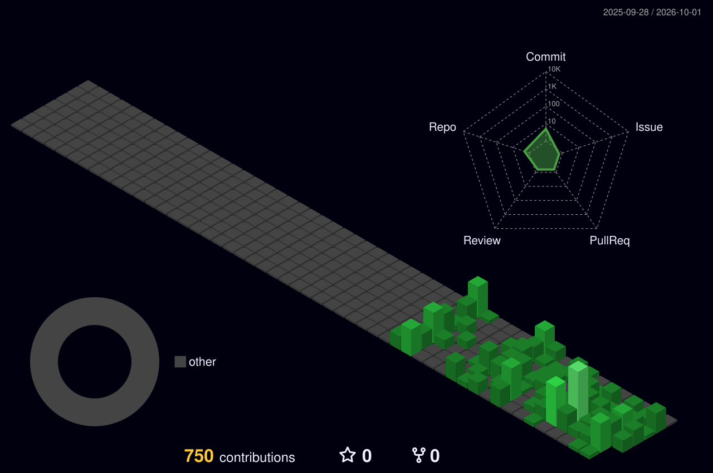

# Olá, eu sou o Jhony Bucker

**Administrador de TI / Microsoft 365** · automação de rotinas · Next.js + Microsoft Graph + PowerShell

[🚀 Easy Tech](#-easy-tech) · [📁 Projetos](#-projetos) · [🧭 Como eu trabalho](#-como-eu-trabalho) · [🔧 Stack](#-stack) · [📫 Contato](#-contato)

## 🚀 Easy Tech

Meu projeto principal: um **portal interno de TI** que centraliza contas Microsoft 365, termos de
equipamento, inventário, licenças e contratos — com **8 módulos e 15 automações**, sem nenhum
servidor próprio (Next.js na Vercel + GitHub Actions).

➡️ Arquitetura, decisões técnicas e números: **[jhonybucker/easytech-showcase](https://github.com/jhonybucker/easytech-showcase)**

## 📁 Projetos

| Projeto | O que é | Stack |
|---|---|---|
| [easytech-showcase](https://github.com/jhonybucker/easytech-showcase) | Vitrine do Easy Tech: o que o sistema faz, arquitetura e decisões técnicas | Next.js · TypeScript · Microsoft Graph · GitHub Actions |
| [lab-banco-digital-oo](https://github.com/jhonybucker/lab-banco-digital-oo) | Banco digital em Java com orientação a objetos (lab DIO) | Java |
| [lab-padroes-projeto-java](https://github.com/jhonybucker/lab-padroes-projeto-java) | Exemplos de padrões de projeto em Java (lab DIO) | Java |
| [desafio-poo-dio](https://github.com/jhonybucker/desafio-poo-dio) | Desafio de POO em Java (DIO) | Java |
| [trilha-java-basico](https://github.com/jhonybucker/trilha-java-basico) | Estudos da trilha básica de Java (DIO) | Java |
| [api-bootcamp-santander](https://github.com/jhonybucker/api-bootcamp-santander) | Estudos do bootcamp Santander (DIO) | Java |
| [dio-lab-open-source](https://github.com/jhonybucker/dio-lab-open-source) | Lab de contribuição open source (DIO) | Git · GitHub |
| [wallpaper-host](https://github.com/jhonybucker/wallpaper-host) | Hospedagem de imagem | — |

## 🧭 Como eu trabalho

- **Teste antes do código** — nada entra no ar sem teste automatizado.
- **Nada irreversível sem simulação** — ação em lote roda em dry-run primeiro.
- **Privacidade por padrão** — log guarda contagem, nunca dado pessoal.
- **Duas IAs, papéis separados** — uma desenha e escreve o plano, outra executa tarefa por tarefa.
- **Deploy contínuo** — cada mudança aprovada vai para produção em minutos.

## 🔧 Stack

| Grupo | Tecnologias |
|---|---|
| **Linguagens** | TypeScript · JavaScript · PowerShell · Python · Java |
| **Web e back-end** | Next.js (App Router) · React · Node.js · REST APIs · Vercel |
| **Microsoft 365 e nuvem** | Microsoft Graph (app-only) · Entra ID · Exchange Online · SharePoint · OneDrive |
| **Ferramentas** | GitHub Actions · git · VS Code · tesseract.js (OCR) · @react-pdf/renderer · exceljs |

## 🐍 Contribuições

<picture>
  <source media="(prefers-color-scheme: dark)" srcset="dist/github-snake-dark.svg" />
  <source media="(prefers-color-scheme: light)" srcset="dist/github-snake.svg" />
  
</picture>

## 📫 Contato

- 💼 [LinkedIn](https://www.linkedin.com/in/jhony-bucker/)
- 📧 [jhonybucker2@gmail.com](mailto:jhonybucker2@gmail.com)

*Aberto a conversar sobre automação, Microsoft 365 e o uso de IA no desenvolvimento — me chame!*
